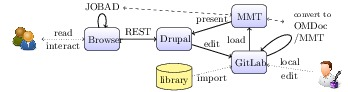

# MathHub Architecture

[MathHub.info](http://mathhub.info) is a portal for handling
flexiformal documents and active mathematical documents. It consists of
the following parts:

- A [React.JS](https://reactjs.org)-based [[front end|Mathhub-Front-End]] for user management, discussion
   forums, community features, etc,
- [JOBAD](https://github.com/KWARC/jobad) for active document features,
- The [MMT API](http://uniformal.github.io) for logic-based services,
- [[MMT build system|build-system]] for transformation from the various
   [[surface formats|surface-formats]] to [[OMDoc/MMT|omdoc-mmt]]. 
- A [GitLab](http://gitlab.org) instance <http://gl.mathhub.org> for management of GIT-based repositories.

These are coordinated and orchestrated as
[a swarm of docker containers](https://github.com/MathHubInfo/MathHub), which also give
basic administrative functionality. 

All MathHub content is stored in GIT repositories, that are managed in a special GitLab
instance: <http://gl.mathhub.info>. The repositories are organized into
[[libraries|libraries]] (usually for community-supported resources; which may maintained
on MathHub or be imported from an external library for archiving) and
[[user spaces|user-spaces]] (personal collections of flexiformal repositories).

MathHub content can be authored both in a [[online interface|online-authoring]] or a
[[offline workflow|offline-authoring]]. The two workflows are coordinated by GIT-based
distribution facilities.

([[Flexiformal|FlexiForms]]) content is uniformly represented
in the [[OMDoc/MMT|omdoc-mmt]] format for
[[interoperability|interoperability]], but can be
authored/edited in various [[surface formats|surface-formats]]
better suited for human manipulation and then converted to OMDoc by the
[[MathHub build system|build-system]], which also supports
collection maintenance by error reporting and continuous integration.

The MathHub [[front end|Mathhub-Front-End]] is user-independent.  User/account management is relegated to
GitLab, and access control is provided by GIT at the level of
[[math archives|math-archives]]: a user can work with all the content in MathHub she can
clone from GitLab.

User-specific semantic services are provided by service providers, e.g.  the
[MMT API](http://uniformal.github.io), which load a subset of the MathHub content visible
to the respective user into a local working copy and provide services and interactions on
this basis. To be able to serve multiple users at the same time, MathHub bundles working
copies, [[build processes|build-system]], and service providers into
[[MathHub workers|workers]]. The [[front end|Mathhub-Front-End]] only relays user requests and generated content
in a uniform interface.
